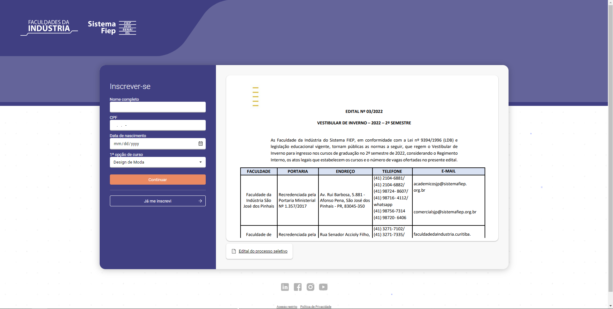
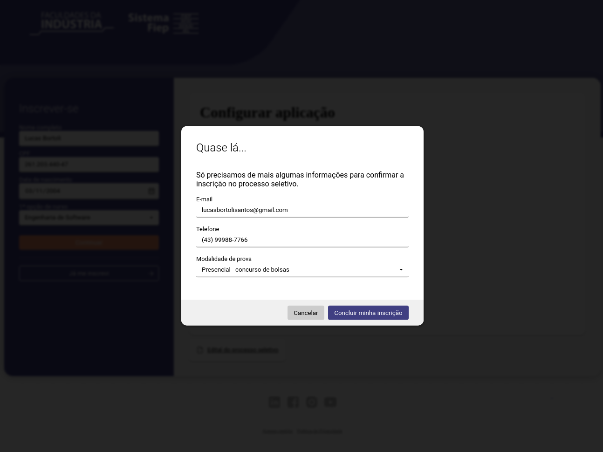
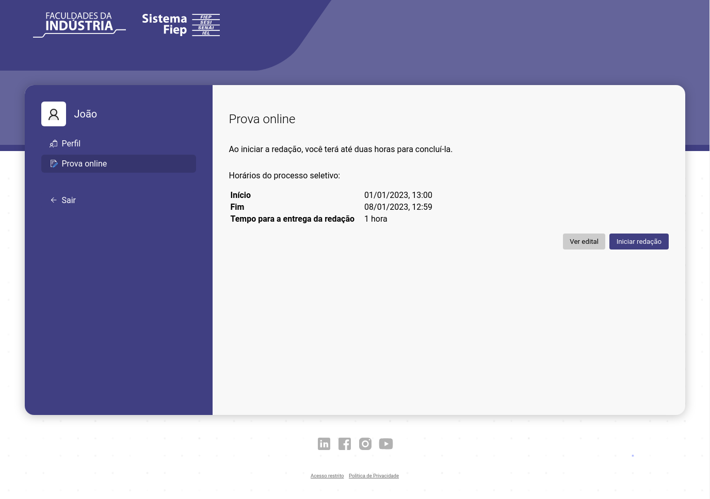
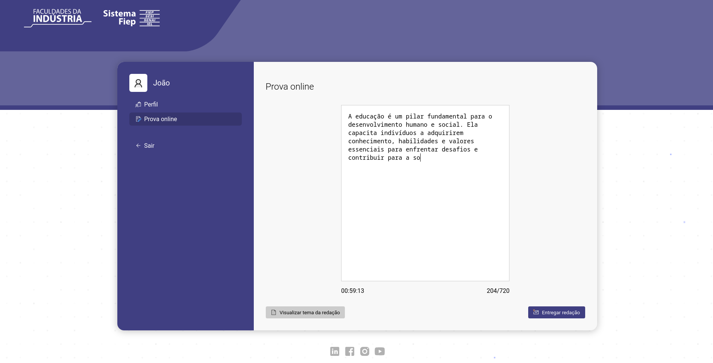
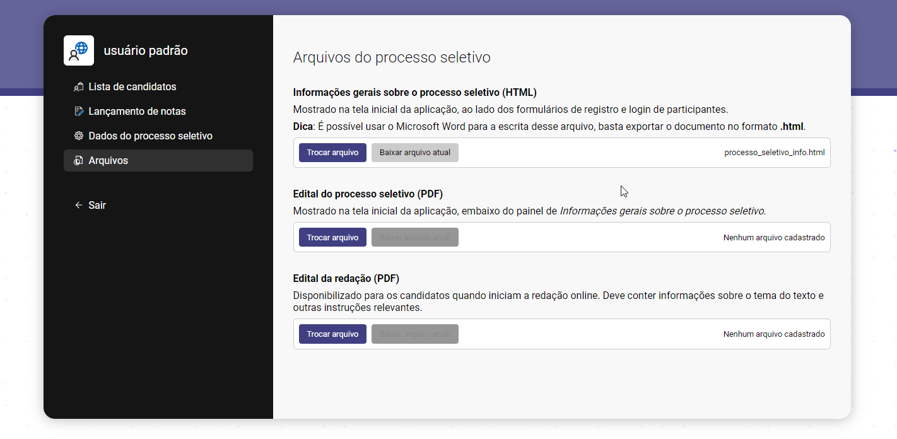

# Sistema de Vestibular - Faculdades da Indústria - Frontend

Esse é o repositório do Sistema de Vestibular das Faculdades da Indústria. Este projeto foi desenvolvido para o estudo de caso de gerenciamento do vestibular.

## Stack Utilizada

O sistema foi desenvolvido utilizando as seguintes tecnologias:

- Linguagem: TypeScript
- Backend: Node.js
- Banco de Dados: SQLite
- Containerização: Docker

Esse projeto é apenas o front-end. Veja: https://github.com/lucas-bortoli/vestibular.backend

## Contato

Se você tiver alguma dúvida ou problema em relação a este sistema, sinta-se à vontade para entrar em contato: lucasbortolisantos@gmail.com

Atenciosamente, \
Lucas Vinicius de Bortoli Santos
